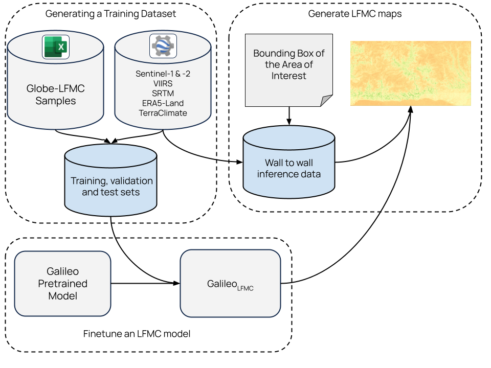

# Live Fuel Moisture Content (LFMC) Mapping from Multimodal Earth Observation Data

Wildfires are growing in intensity and severity, increasing the need for timely, high-resolution monitoring of wildfire risk factors. Live Fuel Moisture Content (LFMC) is a key variable for both research and operational response, but ground-based measurements are sparse and costly. This project uses a pretrained, multimodal Earth observation model to generate large-scale, spatially complete LFMC maps.

For more information, please see our [paper](https://arxiv.org/abs/2506.20132).

## Documentation

* [Setup](docs/setup.md)
* [Experiments](docs/experiments.md)
